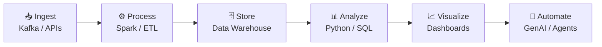

<div align="center">


<a href="https://git.io/typing-svg">
  
</a>

<br/>


<a href="https://github.com/ItsFaizan-official">
  
</a>
<a href="https://github.com/ItsFaizan-official?tab=followers">
  
</a>


</div>


## 🧠 Who Am I?

> *"Data without intelligence is just noise. I turn that noise into signal."*

I'm **Faizan Khan** — a **Data Engineer & AI Specialist** who architects intelligent systems at the intersection of **Big Data**, **Machine Learning**, and **Generative AI**. I don't just build pipelines — I build **data ecosystems** that think, learn, and scale.

- 🔭 Currently deep-diving into **Agentic AI, LLM Orchestration & Real-Time Data Engineering**
- 🛠️ I design end-to-end **ETL/ELT pipelines** that power AI-driven decision engines
- 🤖 Building with **LangChain, LlamaIndex, OpenAI, HuggingFace** to create production-grade GenAI apps
- 📊 Making data **speak visually** through Power BI, Tableau, and custom dashboards
- 💼 Bridging the gap between **raw data chaos** and **boardroom-ready insights**

<div align="center">

## 🧠 Data Engineering Flow



</div>


## 🚀 Core Domains

<div align="center">

| 🏗️ Data Engineering | 🤖 AI / ML | 📊 Analytics | 🧬 Generative AI |
|:---:|:---:|:---:|:---:|
| ETL/ELT Pipelines | Machine Learning | Power BI Dashboards | LLMs & Prompt Eng. |
| Apache Kafka | Deep Learning | Tableau Storytelling | LangChain & Agents |
| Apache Spark | Model Deployment | SQL & Data Modeling | RAG Systems |
| Data Warehousing | Feature Engineering | Statistical Analysis | Vector Databases |
| Real-time Streaming | MLOps & AutoML | KPI & Metric Design | AI-Powered Apps |

</div>


## 🛠️ Technology Arsenal

<table align="center">
<tr>
<td align="center" width="50%">

### 🐍 Languages & Querying
<p>


</p>

</td>

<td align="center" width="50%">

### 🤖 AI / ML
<p>


</p>

</td>
</tr>

<tr>
<td align="center">

### 🏗️ Data Engineering
<p>


</p>

</td>

<td align="center">

### 🗄️ Databases & Cloud
<p>


</p>

</td>
</tr>

<tr>
<td align="center">

### 📊 Analytics
<p>


</p>

</td>

<td align="center">

### ⚙️ DevOps
<p>


</p>

</td>
</tr>
</table>


## 📊 GitHub Intelligence Dashboard

<div align="center">

<!-- Row 1: Stats + Streak -->

<br/><br/>


<br/><br/>


<!-- Row 3: Activity Graph (full width) -->


<br/><br/>

<!-- Row 4: Profile Summary Cards -->


<br/>


<p align="center">
  
  
  
  
  
</p>


## 🧾 ⚡ Developer Metrics Dashboard

<table align="center">
  
<tr>
  
<td align="center">

### 🌟 Engagement

<br/>


</td>

<td align="center">

### 💻 Activity

<br/>


</td>
</tr>

<tr>
<td align="center">

### 🔀 Collaboration

<br/>


</td>

<td align="center">

### 🐛 Maintenance

<br/>


</td>
</tr>
</table>

## 🏅 ⚡ Achievement System

<p align="center">
  
</p>


<table align="center">
<tr>
<th>🏅 Achievement</th>
<th>🎯 Category</th>
<th>📊 Stats</th>
<th>🎖️ Tier</th>
</tr>

<tr>
<td>⭐ Stars Earned</td>
<td>Community Recognition</td>
<td>Starred by developers</td>
<td></td>
</tr>

<tr>
<td>💻 Total Commits</td>
<td>Code Contributions</td>
<td>321+ commits</td>
<td></td>
</tr>

<tr>
<td>🔀 Pull Requests</td>
<td>Code Reviews</td>
<td>18+ PRs merged</td>
<td></td>
</tr>

<tr>
<td>🐛 Issues Raised</td>
<td>Problem Tracking</td>
<td>Reported & resolved</td>
<td></td>
</tr>

<tr>
<td>📁 Repositories</td>
<td>Projects Built</td>
<td>23 public repos</td>
<td></td>
</tr>

<tr>
<td>👥 Followers</td>
<td>Developer Network</td>
<td>Growing community</td>
<td></td>
</tr>

<tr>
<td>🍴 Forks Gained</td>
<td>Community Impact</td>
<td>33 forks earned</td>
<td></td>
</tr>

<tr>
<td>⚡ Quickdraw</td>
<td>First Achievement</td>
<td>Unlocked on GitHub</td>
<td></td>
</tr>

</table>


## 💡 My Philosophy

<div align="center">

```python
class FaizanKhan:

    def __init__(self):
        self.name        = "Faizan Khan"
        self.role        = ["Data Engineer", "AI Specialist", "GenAI Builder"]
        self.location    = "Nagpur, India 🇮🇳"
        self.mission     = "Turn raw data into intelligence"

    @property
    def tech_stack(self):
        return {
            "data_engineering" : ["Kafka", "Spark", "Hadoop", "Airflow", "dbt"],
            "ai_ml"            : ["TensorFlow", "PyTorch", "Scikit-Learn", "HuggingFace"],
            "generative_ai"    : ["OpenAI GPT", "LangChain", "LlamaIndex", "RAG", "Agents"],
            "databases"        : ["PostgreSQL", "MongoDB", "Snowflake", "Pinecone"],
            "cloud"            : ["AWS", "Azure", "GCP"],
            "visualization"    : ["Power BI", "Tableau", "Plotly", "Matplotlib"]
        }

    def current_focus(self):
        return "Agentic AI + Data Engineering = Future 🚀"

me = FaizanKhan()
print(me.current_focus())
# Output: Agentic AI + Data Engineering = Future 🚀
```

</div>


## 📈 Contribution Snake

<div align="Left">
<picture>
  <source media="(prefers-color-scheme: dark)" srcset="https://raw.githubusercontent.com/platane/snk/output/github-contribution-grid-snake-dark.svg" />
  <source media="(prefers-color-scheme: light)" srcset="https://raw.githubusercontent.com/platane/snk/output/github-contribution-grid-snake.svg" />
  
</picture>
</div>


## 🌐 Let's Connect & Collaborate

<div align="center">

<a href="https://www.linkedin.com/in/faizankhanofficial71/" target="_blank">
  
</a>
&nbsp;
<a href="https://github.com/ItsFaizan-official" target="_blank">
  
</a>
&nbsp;
<a href="mailto:faizankhanofficial71@gmail.com">
  
</a>
&nbsp;
<a href="tel:+91-8459414569">
  
</a>

</div>
<br/><br/>

> 💬 *"Open to collaborations on Data Engineering, AI/ML projects, and GenAI product builds."*

<br/>


</div>
